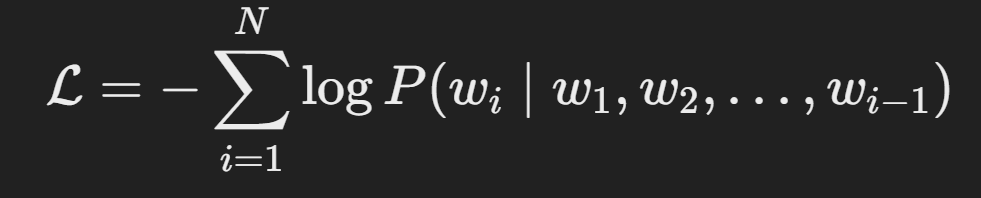

# Lyrics Generator Using GPT-2 with Hugging Face 🤖🎶

## 1. Introduction

Have you ever wanted to create lyrics on the fly, inspired by your favorite artists or unique prompts? This project leverages the powerful **GPT-2** model to generate lyrics, combining state-of-the-art NLP techniques with the flexibility of Hugging Face's 🤗 Transformers library.

### What This Project Does:
- 🎤 **Generates Lyrics:** Provide a prompt, and the model generates creative, coherent lyrics.
- 🛠️ **Customizable:** Fine-tune the model on any dataset to emulate specific styles or genres.
- 🔄 **Interactive:** Easy to use, whether for artistic exploration or enhancing your NLP skills.

### Why It's Exciting:
- **AI Creativity:** Explore how AI can mimic human-like lyric composition.
- **Easy to Use:** The Hugging Face Transformers library simplifies model training and inference.
- **Powerful Model:** GPT-2’s Transformer-based architecture ensures quality outputs.

> Imagine starting with a simple input like:  
> _"Walking down the road of life"_  
> And seeing the model continue with a full stanza:
> _"Through the shadows and the light,  
> Chasing dreams through endless nights."_  
> This is the power of AI-assisted creativity!

This project aims to inspire creativity and explore the fascinating intersection of AI and art.

## 2. Why Use GPT-2 for Lyrics Generation? 🤔🎤

GPT-2 stands out as a go-to model for generating creative text, making it an ideal choice for crafting song lyrics. Here's why:

### Key Strengths of GPT-2:
1. **Fluency and Coherence:**
   - GPT-2’s Transformer-based architecture generates text that flows naturally, mimicking human-like patterns.
   - This makes it perfect for lyrical structures, including rhymes, rhythms, and repetitive themes.

2. **Versatility:**
   - GPT-2 can adapt to various tones, styles, and genres with fine-tuning.
   - Want pop lyrics? Rock ballads? Poetry? It’s all achievable!

3. **Contextual Awareness:**
   - The model remembers context over longer sequences, allowing for richer and more meaningful lyrics.
   - Example:
     - Input Prompt: _"Through the storms of life"_  
     - Output: _"I found a guiding star to end the strife."_

4. **Pre-trained Power:**
   - GPT-2 has been trained on massive amounts of text data, giving it a robust understanding of language nuances.

### Why Lyrics Generation?
- **Creative Expression**: Use AI as a partner in your songwriting process.
- **Efficiency**: Skip writer’s block by letting GPT-2 suggest ideas and lines.
- **Experimentation**: Explore genres and styles with ease, without needing extensive knowledge of music theory or poetry.

GPT-2 combines linguistic power with creative adaptability, making it the perfect tool for generating meaningful, engaging lyrics.

## 3. Why Hugging Face's Transformers Library? 🤗🚀

Hugging Face’s Transformers library simplifies the entire process of working with GPT-2, from fine-tuning to inference. Here’s why it’s the perfect choice for this project:

### Key Advantages:
1. **Pre-trained Models Ready to Use:**
   - The library provides pre-trained GPT-2 models, reducing the need for training from scratch.
   - Simply fine-tune the model on your lyrics dataset for customized outputs.

2. **User-Friendly API:**
   - Easy-to-understand methods for loading, training, and generating text.
   - Example:
     ```python
     from transformers import GPT2LMHeadModel, GPT2Tokenizer
     model = GPT2LMHeadModel.from_pretrained("gpt2")
     tokenizer = GPT2Tokenizer.from_pretrained("gpt2")
     ```
     With a few lines of code, you’re ready to generate lyrics.

3. **Flexibility:**
   - Supports multiple frameworks, including TensorFlow and PyTorch.
   - Adaptable for use cases like training on your own hardware or leveraging cloud platforms.

4. **Community and Support:**
   - Hugging Face offers extensive documentation and an active community.
   - Pre-trained models and datasets are widely shared for quick experimentation.

5. **Fine-Tuning Made Simple:**
   - Fine-tuning GPT-2 for lyrics generation is streamlined using Hugging Face’s Trainer API.
   - Example training loop:
     ```python
     from transformers import Trainer, TrainingArguments
     trainer = Trainer(
         model=model,
         args=TrainingArguments(output_dir="./results"),
         train_dataset=train_dataset
     )
     trainer.train()
     ```

### Why It Matters for This Project:
- Hugging Face makes complex NLP tasks accessible without requiring deep expertise in Transformers.
- It bridges the gap between theory and practical implementation, allowing you to focus on creativity.

With Hugging Face, building a lyrics generator becomes less about coding complexity and more about crafting the perfect lyrical flow.

## 4. Mathematics Behind GPT-2 📚🤖

GPT-2 is a Transformer-based model designed for language generation. At its core, it relies on the following mathematical principles and mechanisms:

### 1. Transformer Architecture
The GPT-2 model is built on the Transformer architecture, which uses **self-attention** and **positional encoding** to process text efficiently.

#### Key Components:
- **Input Embedding (\( X_e \)):**
  - Each word in the input sequence is converted into a dense vector representation.
  - Example:
    - Input: _"Hello, world!"_
    - Token Embedding: \([e_{hello}, e_{,}, e_{world}, e_{!}]\)

- **Positional Encoding (\( P \)):**
  - Adds information about word order to the embeddings.
  - Final Input: \( X = X_e + P \)

- **Self-Attention Mechanism:**
  - Computes relationships between all tokens in the sequence:
    \[
    \text{Attention}(Q, K, V) = \text{softmax}\left(\frac{QK^T}{\sqrt{d_k}}\right)V
    \]
    - \( Q \), \( K \), and \( V \): Query, Key, and Value matrices derived from \( X \).
    - \( d_k \): Dimension of the key vectors.

- **Feedforward Neural Networks:**
  - Applies dense layers to transform attention outputs:
    \[
    FFN(X) = \text{ReLU}(XW_1 + b_1)W_2 + b_2
    \]

### 2. Autoregressive Modeling
GPT-2 predicts the next word in a sequence using its **autoregressive property**:
\[
P(w_1, w_2, \dots, w_n) = \prod_{i=1}^n P(w_i \mid w_1, w_2, \dots, w_{i-1})
\]

For example:
- Input: _"Walking through the"_
- Predicted next word: _"forest"_.

### 3. Training Objective
GPT-2 is trained using a **causal language modeling (CLM)** objective:
\[
\mathcal{L} = -\sum_{i=1}^N \log P(w_i \mid w_1, w_2, \dots, w_{i-1})
\]
Where:
- \( w_i \): Current word.
- \( w_1, w_2, \dots, w_{i-1} \): Context of previous words.

### 4. Fine-Tuning for Lyrics
Fine-tuning adjusts GPT-2’s weights on a lyrics dataset:
- Training Objective remains the same, but focuses on the patterns in lyrical data (e.g., rhymes, repetitions).

### Example:
1. **Input:** _"Under the moonlight, so bright"_
2. **GPT-2 Attention Mechanism:**
   - Encodes the relationship between words (e.g., "moonlight" and "bright").
3. **Output:** _"I dance till the morning light."_

By combining these mathematical concepts, GPT-2 generates coherent, context-aware, and creative lyrics.

## 5. Example Data Flow 🚀📄

This section demonstrates how a sample prompt flows through the lyrics generation pipeline using GPT-2, breaking down each step with details.

---

### Step 1: Input Preprocessing
1. **Input Prompt:**
   - Example: _"The sun sets over the ocean"_
2. **Tokenization:**
   - The input is split into tokens using Hugging Face’s tokenizer:
     ```python
     from transformers import GPT2Tokenizer
     tokenizer = GPT2Tokenizer.from_pretrained("gpt2")
     tokens = tokenizer.encode("The sun sets over the ocean", return_tensors="pt")
     ```
   - Tokenized Output: `[464, 795, 1524, 1426, 481, 262, 3035]`

3. **Padding (if needed):**
   - Ensures all inputs have the same length.

---

### Step 2: Feeding Input to the Model
- The tokenized input is passed to GPT-2 for generating predictions:
  ```python
  from transformers import GPT2LMHeadModel
  model = GPT2LMHeadModel.from_pretrained("gpt2")
  output = model.generate(tokens, max_length=20, num_return_sequences=1)

- Example Output: "The sun sets over the ocean, painting the sky with golden hues."

Example Result:
Prompt: "Under the starlit sky, I wonder"
Generated Output: "What secrets the night will uncover, as the winds whisper softly by."


## 6. How I Made It 🛠️✨

The implementation of this lyrics generator involved several key steps, utilizing GPT-2 and Hugging Face's Transformers library to ensure seamless model training and inference. Here's a breakdown of the process:

---

### Step 1: Setting Up the Environment
- **Tools and Frameworks:**
  - Python 3.7+ for scripting and execution.
  - Hugging Face 🤗 Transformers library for pre-trained GPT-2.
  - PyTorch backend for computation.
  - Matplotlib and NumPy for visualization and data manipulation.
- Installed dependencies using:
  ```bash
  pip install transformers torch numpy matplotlib

### Step 3: Model Preparation
Loading GPT-2:

Initialized a pre-trained GPT-2 model using Hugging Face:
python
Copy code
from transformers import GPT2LMHeadModel
model = GPT2LMHeadModel.from_pretrained("gpt2")
Fine-Tuning:

Adjusted the pre-trained model to specialize in lyrics generation by training it on the custom dataset:
Used Hugging Face’s Trainer API for easy fine-tuning:
python
Copy code
from transformers import Trainer, TrainingArguments
training_args = TrainingArguments(
    output_dir="./results",
    num_train_epochs=3,
    per_device_train_batch_size=4,
    save_steps=10_000
)
trainer = Trainer(
    model=model,
    args=training_args,
    train_dataset=train_dataset
)
trainer.train()
### Step 4: Training the Model
Objective:

Used the causal language modeling objective:

Optimization:

Optimized using the AdamW optimizer for efficient parameter updates.
Monitoring Progress:

Tracked loss values to ensure steady convergence.
### Step 5: Generating Lyrics
Once trained, the model was used to generate lyrics from a given prompt:
python
Copy code
generated = model.generate(
    input_ids=tokens,
    max_length=50,
    num_return_sequences=1
)
print(tokenizer.decode(generated[0], skip_special_tokens=True))
### Step 6: Visualizing and Evaluating Results
Generated Samples: Evaluated the coherence and creativity of generated lyrics.
Loss Curves: Plotted training loss to analyze convergence.